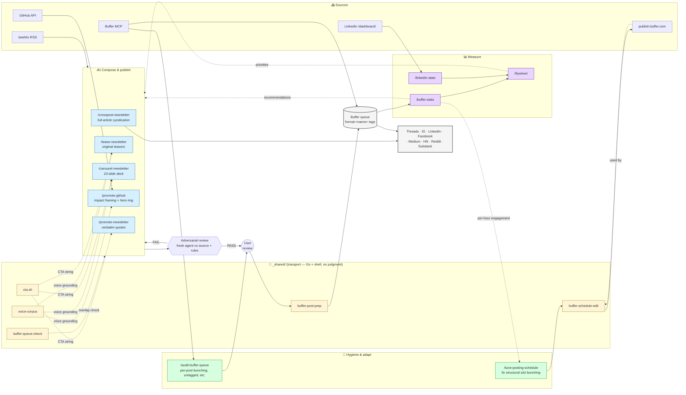

# Claude Social Media Skills

Claude Code skills for promoting and syndicating your work on social media — designed as a **closed loop** where every post is tagged at compose time so the analytics skills can attribute engagement back to the format that produced it, then auto-generate skill-config recommendations from each week's data.

See **[ARCHITECTURE.md](ARCHITECTURE.md)** for the design philosophy, **[PATTERNS.md](PATTERNS.md)** for cross-skill cognition patterns (adversarial review, voice grounding, React form input setter, queue overlap check, CTA convention), and **[PRIMITIVE-TEST.md](PRIMITIVE-TEST.md)** for the framework deciding what belongs in code (`_shared/` Go binaries) vs prompts (skill SKILL.md).

## How the skills relate



**The loop:** Compose with format tag → adversarial review → user publish → Buffer fans out → Measure attributes engagement back to format → Recommendations feed next compose run.

## Skills

### ✍️ Compose & publish (write side)

#### `/promote-newsletter`
Extract verbatim snippets from a [beehiiv](https://beehiiv.com) newsletter post and schedule platform-specific posts via Buffer. Preserves the author's original words — only trims to fit character limits. Tag: `format:verbatim-quote`.

```
/promote-newsletter https://www.example.com/p/my-post
/promote-newsletter latest
```

#### `/tease-newsletter`
Sibling to `/promote-newsletter`. Writes short original teaser hooks per channel that summarize the article without spoiling the punchline. Same `Comment "newsletter"…` CTA so the same DM automation works. **Recommended default for LinkedIn channels** (verbatim quotes underperform there). Pulls voice corpus to match author's writing voice. Tag: `format:teaser`.

```
/tease-newsletter https://www.example.com/p/my-post
/tease-newsletter latest
```

#### `/carousel-newsletter`
Promote a beehiiv newsletter as a 10-slide illustrated carousel for Instagram, LinkedIn, Facebook, and Threads. Uses Gemini 2.5 Flash Image with the EVC brand banner as style reference. ~$0.40 per deck, ~15 min wall-clock. Original-copy slides (hook/section/stat) pull voice corpus; quote slides stay verbatim. Tag: `format:carousel`.

```
/carousel-newsletter https://www.example.com/p/my-post
```

#### `/promote-github`
Fetch your public GitHub contributions (merged PRs, commits, releases, new repos) and compose value/impact-framed social media posts. Generates **one Gemini-illustrated hero image per theme** (~$0.04/image; same brand pipeline as carousel). Voice-grounded against your recent newsletters so posts sound like you. Defaults to instant-publish; pass `queue` to add to queue instead. Tags: `format:link-share` (individual) or `format:batch-summary` (batched).

```
/promote-github today
/promote-github this-week
/promote-github 2026-03-01..2026-03-30
/promote-github https://github.com/user/repo/pull/123
```

#### `/crosspost-newsletter`
Cross-post a beehiiv newsletter article across five platforms in two modes:

- **Full-article syndication** to LinkedIn (native article), Substack, and Medium — preserves rich formatting, headings, and images. Sets canonical URL back to the original post.
- **Link submission** to Hacker News and Reddit — submits the beehiiv URL with the article title. For Reddit, picks one or more subreddits from a configurable default list.

Doesn't go through Buffer (publishes directly to platform native editors); closed-loop attribution for the LinkedIn pulse comes from `/linkedin-stats`.

```
/crosspost-newsletter https://www.example.com/p/my-post
/crosspost-newsletter latest
```

### 📊 Measure (closed-loop input)

#### `/buffer-stats`
Combine Buffer's MCP (operational data: queue depth, posting goals) with a gstack scrape of Buffer Insights + Analyze (engagement: per-channel followers, impressions, top posts, format-performance). Auto-generates skill-config recommendations from this week's format-performance data.

```
/buffer-stats
/buffer-stats operational    # MCP-only fast path, no browser
/buffer-stats --days 30
/buffer-stats --compare 2026-04-19    # diff against specific snapshot
```

#### `/linkedin-stats`
Scrape LinkedIn Creator analytics (`/dashboard/`, `/analytics/creator/content`, `/analytics/creator/audience`) for newsletter subs, profile followers, company-page followers, post impressions, and per-post engagement. Caches snapshots for week-over-week deltas.

```
/linkedin-stats
/linkedin-stats newsletter   # newsletter only, fast path
/linkedin-stats --since 2026-04-19
```

#### `/flywheel`
Cross-platform weekly rollup keyed to your 5 growth priorities. Combines `buffer-stats` + `linkedin-stats` + YouTube + beehiiv into one report. Includes per-channel ROI scoring to surface deprioritization candidates.

```
/flywheel
```

### 🧹 Hygiene & adapt (close-the-loop side)

#### `/audit-buffer-queue`
Inspect the Buffer queue for health issues that aren't caught by the per-skill scheduling logic — bunching (gap < 3h between posts on the same channel), theme over-saturation, untagged posts that break closed-loop measurement, dead channels, below-threshold channels. Recommends 1-click cancel / reschedule / tag actions.

```
/audit-buffer-queue
```

#### `/tune-posting-schedule`
Analyze each Buffer channel's `postingSchedule` (the time slots Buffer drops queued posts into) and propose + apply a better one. **Pairs with `/audit-buffer-queue`:** that skill cancels/reschedules individual bunched posts; this one fixes the **slots** so bunches stop recurring. Uses gap-spacing rules + (optional) engagement-by-hour data from `/buffer-stats`. Applies via the gstack web-UI driver in `_shared/buffer-schedule-edit/` (Buffer's API can't edit schedules) after explicit per-channel approval.

```
/tune-posting-schedule
/tune-posting-schedule threads-mikelady,facebook-evc
```

## `_shared/` transport helpers

Pure-transport (deterministic, no judgment) per [PRIMITIVE-TEST.md](PRIMITIVE-TEST.md). Skills call these for plumbing; cognition stays in skill prompts.

| Helper | Used by | Purpose |
|---|---|---|
| [`voice-corpus`](_shared/voice-corpus/) | `/tease-newsletter`, `/promote-github`, `/carousel-newsletter` | Fetches recent beehiiv newsletters as voice reference for original-copy compose phases. Cached locally with 7-day TTL. |
| [`cta.sh`](_shared/cta.sh) | All newsletter compose skills | Generates the canonical `Comment "newsletter" to get my latest post, "<Title>"` CTA string (Manychat trigger word — don't edit ad-hoc). |
| [`buffer-post-prep`](_shared/buffer-post-prep/) | All compose skills | Validates + shapes Buffer `create_post` args. Enforces channel filtering (skip disconnected/locked/below-threshold), platform char limits, format-tag attachment. |
| [`buffer-queue-check`](_shared/buffer-queue-check/) | All compose skills + `/audit-buffer-queue` | Substring-matches Buffer posts against keywords for queue/recently-sent overlap detection. |
| [`buffer-schedule-edit`](_shared/buffer-schedule-edit/) | `/tune-posting-schedule` | Drives publish.buffer.com web UI via gstack browse to edit posting schedules + weekly goals (Buffer's API exposes no schedule mutation). |
| [`gstack_auth.sh`](_shared/gstack_auth.sh) | All gstack-using skills | Cookie import + login check for any platform; caller decides handoff vs skip on failure. |

## Setup

1. **Install [Claude Code](https://claude.ai/code)**
2. **Connect a [Buffer MCP server](https://publish.buffer.com/settings/api)** with your Personal Key from the Buffer API settings page (the "Personal Keys" tab — NOT "App Clients" which is for OAuth apps)
3. **Install [gstack](https://github.com/nichochar/gstack) browse** (required for `/crosspost-newsletter`, `/buffer-stats`, `/linkedin-stats`, `/audit-buffer-queue`, `/tune-posting-schedule`)
4. **For carousel + promote-github image generation:** run `gcloud auth application-default login` once. Default project: `gen-lang-client-0527845499` (override via `GOOGLE_CLOUD_PROJECT` env var).
5. **Build the Go helpers in `_shared/`:**
   ```bash
   cd _shared/buffer-post-prep && go build .
   cd ../buffer-queue-check && go build .
   cd ../voice-corpus && go build .
   ```
6. **Symlink each skill directory into `~/.claude/skills/`:**
   ```bash
   for skill in promote-newsletter tease-newsletter carousel-newsletter \
                promote-github crosspost-newsletter \
                buffer-stats linkedin-stats flywheel \
                audit-buffer-queue tune-posting-schedule; do
     ln -s /path/to/claude-social-media-skills/$skill ~/.claude/skills/$skill
   done
   ```
7. **Save the canonical brand banner** to `~/Pictures/evc_banner2.png` (used as Gemini style reference by `/carousel-newsletter` and `/promote-github`)
8. **Use the slash commands from any Claude Code session.** Recommended weekly cadence:
   - As you ship: `/promote-github`, `/promote-newsletter` or `/tease-newsletter`, optionally `/carousel-newsletter` and `/crosspost-newsletter` for major articles
   - Mid-week: `/audit-buffer-queue` if posts feel bunched
   - End-of-week: `/buffer-stats`, `/linkedin-stats`, then `/flywheel` for the weekly rollup
   - Periodically: `/tune-posting-schedule` when the audit keeps re-flagging the same structural bunches
