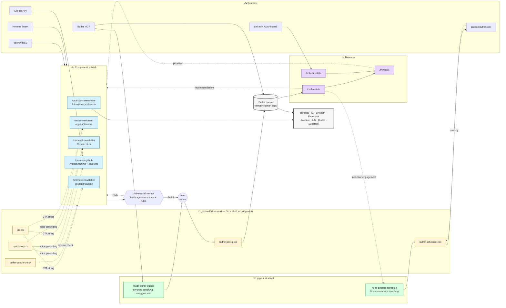

# Claude Social Media Skills

Claude Code skills for promoting and syndicating your work on social media — designed as a **closed loop** where every post is tagged at compose time so the analytics skills can attribute engagement back to the format that produced it, then auto-generate skill-config recommendations from each week's data.

See **[ARCHITECTURE.md](ARCHITECTURE.md)** for the design philosophy, **[PATTERNS.md](PATTERNS.md)** for cross-skill cognition patterns (adversarial review, voice grounding, React form input setter, queue overlap check, CTA convention), and **[PRIMITIVE-TEST.md](PRIMITIVE-TEST.md)** for the framework deciding what belongs in code (`_shared/` Go binaries) vs prompts (skill SKILL.md).

## How the skills relate


```mermaid
flowchart LR
    subgraph SOURCES["📥 Sources"]
        BH[beehiiv RSS]
        GH[GitHub API]
        HT[Hermes Tweet]
        BUF_API[Buffer MCP]
        LI[LinkedIn /dashboard/]
        BUF_WEB[publish.buffer.com]
    end

    subgraph SHARED["🔧 _shared/ (transport — Go + shell, no judgment)"]
        VC[voice-corpus]
        CTA[cta.sh]
        BPP[buffer-post-prep]
        BQC[buffer-queue-check]
        BSE[buffer-schedule-edit]
    end

    subgraph COMPOSE["✍️ Compose & publish"]
        PN["/promote-newsletter<br/><i>verbatim quotes</i>"]
        TN["/tease-newsletter<br/><i>original teasers</i>"]
        CN["/carousel-newsletter<br/><i>10-slide deck</i>"]
        PG["/promote-github<br/><i>impact framing + hero img</i>"]
        XP["/crosspost-newsletter<br/><i>full-article syndication</i>"]
    end

    AR{{Adversarial review<br/>fresh agent vs source + rules}}
    USER((User<br/>review))
    BUFFER[(Buffer queue<br/>format:&lt;name&gt; tags)]
    PLATFORMS[Threads · IG · LinkedIn · Facebook<br/>· Medium · HN · Reddit · Substack]

    subgraph MEASURE["📊 Measure"]
        BS["/buffer-stats"]
        LS["/linkedin-stats"]
        FW["/flywheel"]
    end

    subgraph HYGIENE["🧹 Hygiene & adapt"]
        ABQ["/audit-buffer-queue<br/><i>per-post bunching, untagged, etc.</i>"]
        TPS["/tune-posting-schedule<br/><i>fix structural slot bunching</i>"]
    end

    BH --> COMPOSE
    GH --> PG
    HT --> COMPOSE
    VC -. voice grounding .-> TN
    VC -. voice grounding .-> CN
    VC -. voice grounding .-> PG

    CTA -. CTA string .-> PN
    CTA -. CTA string .-> TN
    CTA -. CTA string .-> CN

    COMPOSE --> AR
    AR -- PASS --> USER
    AR -- FAIL --> COMPOSE
    USER --> BPP
    BPP --> BUFFER
    XP --> PLATFORMS

    BUFFER --> PLATFORMS
    BUF_API --> BUFFER
    BUF_WEB -. used by .-> BSE

    BUFFER --> BS
    LI --> LS
    BS --> FW
    LS --> FW

    BS -. recommendations .-> COMPOSE
    FW -. priorities .-> COMPOSE

    BUF_API --> ABQ
    ABQ --> USER
    BS -. per-hour engagement .-> TPS
    BSE --> BUF_WEB
    TPS --> BSE
    BQC -. overlap check .-> COMPOSE

    classDef shared fill:#fff5d6,stroke:#8b7700
    classDef compose fill:#d6f0ff,stroke:#0066aa
    classDef measure fill:#e8d6ff,stroke:#5500aa
    classDef hygiene fill:#d6ffe0,stroke:#008833
    classDef store fill:#f5f5f5,stroke:#555,stroke-width:2px
    class VC,CTA,BPP,BQC,BSE shared
    class PN,TN,CN,PG,XP compose
    class BS,LS,FW measure
    class ABQ,TPS hygiene
    class BUFFER,PLATFORMS store
```

**The loop:** Compose with format tag → adversarial review → user publish → Buffer fans out → Measure attributes engagement back to format → Recommendations feed next compose run.

## Skills

### Research input (read side)

#### `/hermes-tweet-research`
Collect X/Twitter social signals with [Hermes Tweet](https://github.com/Xquik-dev/hermes-tweet) before drafting Buffer posts. Produces a compact research packet with current posts, handles, links, and angle guidance for the compose skills. Read-only by default; publishing still goes through the existing compose, review, and Buffer path.

```
/hermes-tweet-research "open source launch"
/hermes-tweet-research https://github.com/user/repo
```

### ✍️ Compose & publish (write side)

#### `/promote-newsletter`
Extract verbatim snippets from a [beehiiv](https://beehiiv.com) newsletter post and schedule platform-specific posts via Buffer. Preserves the author's original words — only trims to fit character limits. Tag: `format:verbatim-quote`.

```
/promote-newsletter https://www.example.com/p/my-post
/promote-newsletter latest
```

#### `/tease-newsletter`
Sibling to `/promote-newsletter`. Writes short original teaser hooks per channel that summarize the article without spoiling the punchline. Same `Comment "newsletter"…` CTA so the same DM automation works. **Recommended default for LinkedIn channels** (verbatim quotes underperform there). Pulls voice corpus to match author's writing voice. Tag: `format:teaser`.

```
/tease-newsletter https://www.example.com/p/my-post
/tease-newsletter latest
```

#### `/carousel-newsletter`
Promote a beehiiv newsletter as a 10-slide illustrated carousel for Instagram, LinkedIn, Facebook, and Threads. Uses Gemini 2.5 Flash Image with the EVC brand banner as style reference. ~$0.40 per deck, ~15 min wall-clock. Original-copy slides (hook/section/stat) pull voice corpus; quote slides stay verbatim. Tag: `format:carousel`.

```
/carousel-newsletter https://www.example.com/p/my-post
```

#### `/promote-github`
Fetch your public GitHub contributions (merged PRs, commits, releases, new repos) and compose value/impact-framed social media posts. Generates **one Gemini-illustrated hero image per theme** (~$0.04/image; same brand pipeline as carousel). Voice-grounded against your recent newsletters so posts sound like you. Defaults to instant-publish; pass `queue` to add to queue instead. Tags: `format:link-share` (individual) or `format:batch-summary` (batched).

```
/promote-github today
/promote-github this-week
/promote-github 2026-03-01..2026-03-30
/promote-github https://github.com/user/repo/pull/123
```

#### `/crosspost-newsletter`
Cross-post a beehiiv newsletter article across five platforms in two modes:

- **Full-article syndication** to LinkedIn (native article), Substack, and Medium — preserves rich formatting, headings, and images. Sets canonical URL back to the original post.
- **Link submission** to Hacker News and Reddit — submits the beehiiv URL with the article title. For Reddit, picks one or more subreddits from a configurable default list.

Doesn't go through Buffer (publishes directly to platform native editors); closed-loop attribution for the LinkedIn pulse comes from `/linkedin-stats`.

```
/crosspost-newsletter https://www.example.com/p/my-post
/crosspost-newsletter latest
```

#### `/long-form-pulse`
Schedules a short, voice-matched Buffer **companion announcement** for an already-published LinkedIn pulse article so its engagement is closed-loop attributable — the pulse itself is published natively (off-Buffer) by `/crosspost-newsletter`, leaving that surface unattributed. Tags every post `format:long-form-pulse` and carries an in-text `[lp:<pulse_slug>]` tag. (One-time setup: create the `format:long-form-pulse` tag in Buffer's UI and add its Tag ID to `_shared/buffer-post-prep/tag-ids.local.json`.)

```
/long-form-pulse https://www.linkedin.com/pulse/my-article
```

### 📊 Measure (closed-loop input)

#### `/buffer-stats`
Combine Buffer's MCP (operational data: queue depth, posting goals) with a gstack scrape of Buffer Insights + Analyze (engagement: per-channel followers, impressions, top posts, format-performance). Auto-generates skill-config recommendations from this week's format-performance data.

```
/buffer-stats
/buffer-stats operational    # MCP-only fast path, no browser
/buffer-stats --days 30
/buffer-stats --compare 2026-04-19    # diff against specific snapshot
```

#### `/linkedin-stats`
Scrape LinkedIn Creator analytics (`/dashboard/`, `/analytics/creator/content`, `/analytics/creator/audience`) for newsletter subs, profile followers, company-page followers, post impressions, and per-post engagement. Caches snapshots for week-over-week deltas.

```
/linkedin-stats
/linkedin-stats newsletter   # newsletter only, fast path
/linkedin-stats --since 2026-04-19
```

#### `/tiktok-stats` · `/threads-stats`
Browser-scrape per-post engagement from **TikTok Studio** (`tiktok.com/tiktokstudio/content`) and **Threads Insights** (`threads.com/insights`) in your logged-in Chrome via claude-in-chrome — **no OAuth**, same interactive pattern as `/linkedin-stats`. Each writes `cache/snapshot-*.json` (top-level `recent_posts[]` tagged with `[opus:]`/`[scheme:id]`), which `_shared/content-attribution` reads to resolve the TikTok (`#373`) and Threads (`#375`) platforms in the amplification JOIN + dashboard. Interactive only (needs your logged-in session); skipped on unattended `/flywheel` runs.

```
/tiktok-stats
/threads-stats
```

#### `/flywheel`
Cross-platform weekly rollup keyed to your 5 growth priorities. Combines `buffer-stats` + `linkedin-stats` + YouTube + beehiiv into one report. Includes per-channel ROI scoring to surface deprioritization candidates. Writes a **frozen JSON snapshot** (`~/dev/flywheel-snapshots/<date>.json`, `schema_version:"1"`) the dashboard reads, and runs **Phase 5.5 (Compound)** — grading last week's cross-surface hypotheses and writing next week's into the [`insights/`](insights/) ledger.

```
/flywheel
```

#### `make dashboard` — the single pane of glass
A localhost web app that shows your **whole** presence in one view: reach per surface, format ROI, channel-ROI buckets, the per-source amplification leaderboard (click a source → its derivatives across every platform), the YouTube scatter, voice-corpus freshness, and both hypothesis ledgers side by side. Reads the newest `/flywheel` snapshot live (refresh to pick up a new run); Chart.js is vendored so it renders offline. Pure transport — it renders flywheel's numbers, never recomputes them. See [`_shared/dashboard/`](_shared/dashboard/).

```
make dashboard          # build + serve at http://127.0.0.1:7777 + open browser
```

### 🧹 Hygiene & adapt (close-the-loop side)

#### `/audit-buffer-queue`
Inspect the Buffer queue for health issues that aren't caught by the per-skill scheduling logic — bunching (gap < 3h between posts on the same channel), theme over-saturation, untagged posts that break closed-loop measurement, dead channels, below-threshold channels. Recommends 1-click cancel / reschedule / tag actions.

```
/audit-buffer-queue
```

#### `/tune-posting-schedule`
Analyze each Buffer channel's `postingSchedule` (the time slots Buffer drops queued posts into) and propose + apply a better one. **Pairs with `/audit-buffer-queue`:** that skill cancels/reschedules individual bunched posts; this one fixes the **slots** so bunches stop recurring. Uses gap-spacing rules + (optional) engagement-by-hour data from `/buffer-stats`. Applies via the gstack web-UI driver in `_shared/buffer-schedule-edit/` (Buffer's API can't edit schedules) after explicit per-channel approval.

```
/tune-posting-schedule
/tune-posting-schedule threads-mikelady,facebook-evc
```

## `_shared/` transport helpers

Pure-transport (deterministic, no judgment) per [PRIMITIVE-TEST.md](PRIMITIVE-TEST.md). Skills call these for plumbing; cognition stays in skill prompts.

| Helper | Used by | Purpose |
|---|---|---|
| [`voice-corpus`](_shared/voice-corpus/) | `/tease-newsletter`, `/promote-github`, `/carousel-newsletter` | Fetches recent beehiiv newsletters (written register) **and** YouTube livestream transcripts (spoken register) as voice reference for original-copy compose phases, tagged by `source_type`. Independent TTLs; livestream ingestion degrades gracefully if `youtube_transcript_api` is absent. |
| [`dashboard`](_shared/dashboard/) | `make dashboard` | Localhost single-pane web app over the frozen `/flywheel` snapshot + per-platform drill-downs. Read/render only; offline (vendored Chart.js). |
| [`content-attribution`](_shared/content-attribution/) | `/flywheel`, `/opus-clips-performance` | JOIN engine mapping a source (long-form, newsletter, PR) → every derivative's engagement across platforms, with `amplification_ratio`. |
| [`cta.sh`](_shared/cta.sh) | All newsletter compose skills | Generates the canonical `Comment "newsletter" to get my latest post, "<Title>"` CTA string (Manychat trigger word — don't edit ad-hoc). |
| [`buffer-post-prep`](_shared/buffer-post-prep/) | All compose skills | Validates + shapes Buffer `create_post` args. Enforces channel filtering (skip disconnected/locked/below-threshold), platform char limits, format-tag attachment. |
| [`buffer-queue-check`](_shared/buffer-queue-check/) | All compose skills + `/audit-buffer-queue` | Substring-matches Buffer posts against keywords for queue/recently-sent overlap detection. |
| [`buffer-schedule-edit`](_shared/buffer-schedule-edit/) | `/tune-posting-schedule` | Drives publish.buffer.com web UI via gstack browse to edit posting schedules + weekly goals (Buffer's API exposes no schedule mutation). |
| [`gstack_auth.sh`](_shared/gstack_auth.sh) | All gstack-using skills | Cookie import + login check for any platform; caller decides handoff vs skip on failure. |

## Setup

1. **Install [Claude Code](https://claude.ai/code)**
2. **Connect a [Buffer MCP server](https://publish.buffer.com/settings/api)** with your Personal Key from the Buffer API settings page (the "Personal Keys" tab — NOT "App Clients" which is for OAuth apps)
3. **Install [gstack](https://github.com/garrytan/gstack) browse** (required for `/crosspost-newsletter`, `/buffer-stats`, `/linkedin-stats`, `/audit-buffer-queue`, `/tune-posting-schedule`). These skills call the `browse` binary directly via [`_shared/gstack_auth.sh`](_shared/gstack_auth.sh), so you only need the **browser** component — build it, do **not** run gstack's `./setup` (which would register all 23 gstack skills into `~/.claude/skills/`):
   ```bash
   # Clone outside ~/.claude/skills/ so only `browse` becomes a discoverable skill, not gstack's full suite.
   git clone --depth 1 https://github.com/garrytan/gstack.git ~/.local/share/gstack
   cd ~/.local/share/gstack && bun install && bun run build   # compiles browse/dist/browse
   # Expose only browse/ at the path the skills expect (gstack_auth.sh hardcodes this):
   mkdir -p ~/.claude/skills/gstack
   ln -s ~/.local/share/gstack/browse ~/.claude/skills/gstack/browse
   ```
4. **For carousel + promote-github image generation:** run `gcloud auth application-default login` once. Default project: `gen-lang-client-0527845499` (override via `GOOGLE_CLOUD_PROJECT` env var).
5. **Build the Go helpers** (or just `make build-shared` from the repo root, which builds them all):
   ```bash
   make build-shared        # _shared/* + youtube-analytics, idempotent
   ```
   Livestream voice ingestion also needs `pipx install youtube-transcript-api` (degrades gracefully if absent).
6. **Symlink each skill directory into `~/.claude/skills/`:**
   ```bash
   for skill in promote-newsletter tease-newsletter carousel-newsletter \
                promote-github crosspost-newsletter long-form-pulse \
                buffer-stats linkedin-stats tiktok-stats threads-stats flywheel \
                audit-buffer-queue tune-posting-schedule; do
     ln -s /path/to/claude-social-media-skills/$skill ~/.claude/skills/$skill
   done
   ```
7. **Save the canonical brand banner** to `~/Pictures/evc_banner2.png` (used as Gemini style reference by `/carousel-newsletter` and `/promote-github`)
8. **Use the slash commands from any Claude Code session.** Recommended weekly cadence:
   - As you ship: `/promote-github`, `/promote-newsletter` or `/tease-newsletter`, optionally `/carousel-newsletter` and `/crosspost-newsletter` for major articles
   - Mid-week: `/audit-buffer-queue` if posts feel bunched
   - End-of-week: `/buffer-stats`, `/linkedin-stats`, then `/flywheel` for the weekly rollup (or install the Sunday cron — see next step), then `make dashboard` to see the single pane
   - Periodically: `/tune-posting-schedule` when the audit keeps re-flagging the same structural bunches

9. **(Optional) Install the Sunday weekly-review cron.** Runs the full closed-loop review (`/buffer-stats` → `/linkedin-stats` → `/audit-buffer-queue` → `/flywheel`) headlessly via `claude -p` every Sunday at 09:30 local time and writes the report to `data/reviews/<date>.md`. It also rebuilds the Go binaries, refreshes the dual-source voice corpus, and — via `/flywheel` Phase 5.5 — grades + writes the cross-surface hypothesis ledger and persists the frozen snapshot the dashboard reads. Macros: `make schedule-install`, `make schedule-uninstall`, `make schedule-test` (fires immediately). Logs at `~/Library/Logs/csms-weekly-review/`. Read-mostly — does NOT auto-apply destructive queue actions; surfaces them for your Monday review. After it runs, `make dashboard` shows the week in one pane.
